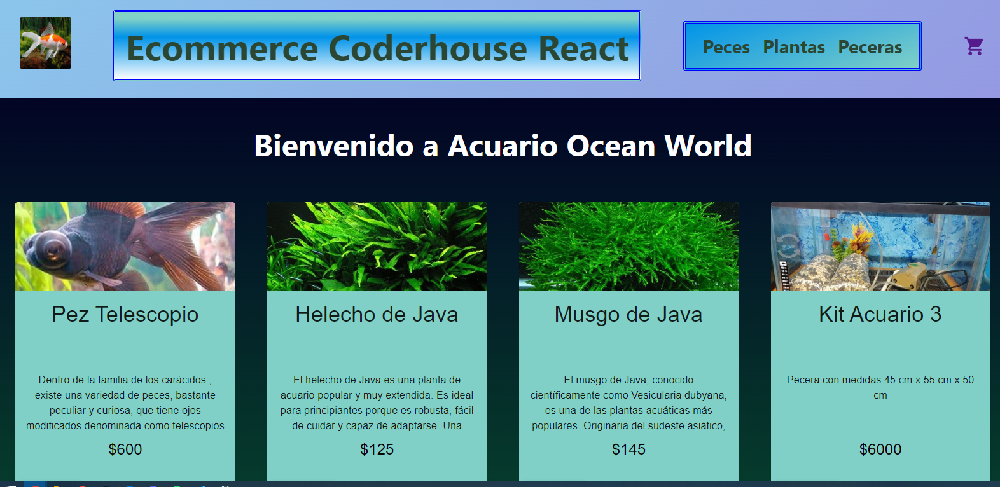
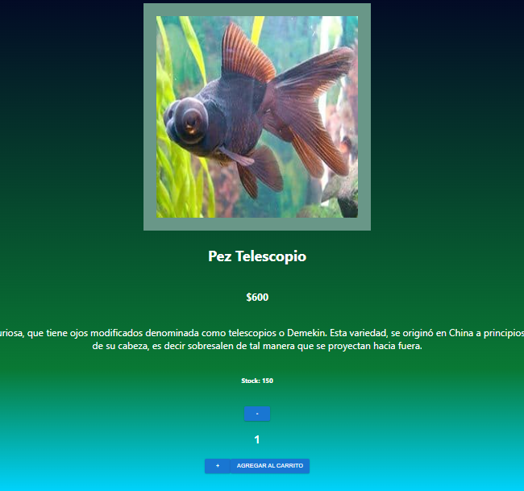

# **CURSO REACT JS CODERHOUSE 2023**

## *ALUMNO: BUGARI NICOLAS*

### *Proyecto Ecommerce Acuario*
[](https://github.com/NicolasBugari/AquiarioReactJS.git)

---

### **Informacion del Proyecto**

Se realiza un Ecommerce basado en el proyecto inicial de la carrera donde se diseño una pagina con referencia a un Acuario, integre el proyecto de React con los datos e imagenes utilizadas en Desarrollo Web.
Implemente:

- React Router
- Bootstrap
- React-Icons
- React-Spinner
- Firebase
- Material Icons

---

**Se utilizo Github para compartir el proyecto**

### Enlace en la parte superior del Readme
---
# **Imagenes del proyecto**

### 1 Home:



### 2 Detalle de Producto:



### 3 Carrito:


### 4 Formulario:


---
## **Para iniciar el proyecto realizar los siguientes pasos**

- Repositorio de Github.

  ```bash
  git clone https://github.com/NicolasBugari/AquiarioReactJS.git
  ```
- cd del proyecto.

  ```bash
  cd AquarioReactJS
  ```
- Instala dependencias.

  ```bash
  npm install
  ```
- Correr el proyecto.
  ```bash
  npm run dev
  ```
---
